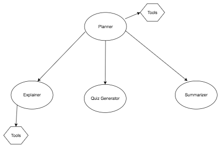

# 🎥 Multimedia Comprehension Agent

## Overview
This project is a multi-agent AI system that automatically analyzes and interprets video and audio content. The system decomposes complex processing tasks into specialized agents responsible for transcription, summarization, explanation of complex concepts, contextual web search, and reflective question generation. By distributing responsibilities across specialized agents, the system improves clarity, accuracy, and user engagement compared to monolithic AI approaches.

---

## Features
- Automatic audio and video transcription
- Content summarization
- Explanation of complex concepts with contextual web search
- Reflective and comprehension-based question generation
- Modular and extensible multi-agent architecture

---

## Tech Stack
- **Programming Language:** Python 3.9+
- **AI / NLP Frameworks:** Langraph, Langchain, Groq
- **Search & Context Retrieval:** TavilySearch
- **Media Downloading & Processing:** yt-dlp
- **Speech-to-Text / Transcription:** AssemblyAI
- **Environment & Dependency Management:** pip, virtualenv
---

## System Architecture
The system follows a modular multi-agent design coordinated by a central planner agent.

Agents:
- Planner Agent – Orchestrates tasks, downloads media, and performs transcription
- Summarizer Agent – Generates concise summaries of the content
- Explainer Agent – Explains complex concepts and retrieves additional context from the web
- Question Generation Agent – Produces reflective and comprehension-driven questions

---

## Project Structure
project-root/

│── workflow/

│   ├── downloads/     # Downloaded audio and video files

│   ├── agent.py       # Agent implementations

│   ├── constants.py   # Custom constants

│   ├── graph.py       # Graph implementation

│   ├── nodes.py       # Nodes implementation

│   ├── prompts.py     # Prompts constructions

│   ├── state.py       # State definition

│   ├── tools.py       # Download, Transcribe, and Search tools

│── requirements.txt   # Python dependencies

│── main.py            # Application entry point

│── README.md          # Project documentation

---

## Requirements
- Python 3.9 or higher
- Git
- pip (Python package manager)
- Internet connection (required for downloads and web search)

---

## Installation
### Clone the repository:
git clone https://github.com/Achala-Elijah/Mastering_AI_Agents.git

cd Mastering_AI_Agents

### Create a virtual environment (recommended):
python -m venv venv

### Activate the virtual environment:
#### Windows:
venv\Scripts\activate

#### macOS / Linux:
source venv/bin/activate

### Install dependencies:
pip install -r requirements.txt

---

## Usage
### Run the application:
python main.py

### Analyze a video or audio file:
1. Place the media file inside the workflow/downloads/ directory
2. Provide the file path as input when prompted
3. The system will transcribe the content, summarize key ideas, explain complex concepts, and generate reflective questions (optional)

---

## Example Query
What is the video ./workflow/downloads/video.mp4 about?

---

## Example Output
The file ./workflow/downloads/video.mp4 appears to be a video file containing a Christian rap song. The lyrics express the artist's faith and trust in Jesus Christ, and how their life has changed for the better since they started following God. The song also touches on themes of sin, redemption, and the importance of staying on the right path. The artist repeats the phrase "I keep my eyes on Jesus Christ" throughout the song, emphasizing their focus on their faith. The overall tone of the song is one of devotion, gratitude, and encouragement to others to follow God's path.

---

## Notes
- The system understands text, audio and video.
- Supported formats include .mp4, .mp3, and .wav
- Internet access is required for contextual web search
- Each agent can be extended or replaced independently

---

## License
No License

---

## Author
Elijah Achala  
AI Engineer
